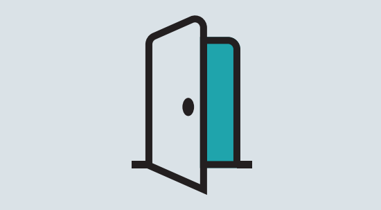

# We are 4Com Technologies!

Hello there, we are 4Com Technologies! 

We are a Telecoms innovater based in Bournemouth, England with several brilliant Software Development teams specialising in the Microsoft .NET stack, Dynamics CRM and we have a lot of cool stuff running in Azure 😊

# Contributions

Slowly, but surely we are looking for opportunities to open source our internal libraries and codebase where we think it could help everyone. 

If you have any feedback or questions around this don't hesitate to contact us using [the email address on our profile](https://github.com/4Com) or pop in an issue / pull request on [one of our repositories](https://github.com/orgs/4Com/repositories).

# Careers

As 4Com continues to grow we are constantly looking for ambitious people to join our ever expanding family.

Technology underpins everything we do at 4Com. 

We recruit for a variety of Developers and technical staff, with some teams having the option of home or hybrid working, whilst others are based at our Bournemouth Head Office. 

Please [take a look at all of our vacancies here](https://www.4com.co.uk/careers/#vacancies).

# Our Values

As a department we've grown and adapted over the last few years, faced challenges like COVID-19 and found new ways of working even when we don't see each other in person every day!

This year we've finally put pen to paper and proudly written down six values that really matter to our teams, and 
[you can find a PDF of these here](4ComTechnologyValues.pdf)

## Openness

Transparent teams and supportive leadership with a no blame culture.

Teams are empowered to always present the actual picture, and this honesty is met with understanding and support, with a collective drive to help and fix rather than find and blame. 

## Collaboration

As part of the Technology Department we all plan, deliver and review on the same cadence, maximising opportunities for cross team conversations and collaboration. 

Being a primarily remote workforce, we champion face to face communication through tools, pairing and swarming on tasks and avoiding siloed development as much as possible.

## Adaptability

Here at 4Com we organise around Value. 

Our fast paced environment does change rapidly, and we need to be flexible and adaptable in order to deliver the highest value for the company. 

Priorities change, and that's ok! 

We don't dwell on a change of plan, we only see these moments as another opportunity to smash it!

## Work Hard Have Fun

Our deparment are driven to deliver value at regular intervals for the company and serve their customers with world leading solutions.

As a group we work hard, but it's important to have fun in our teams. 

The more time at work that doesn't feel like work the better! 

We embark on team outings and prize giving's regularly both in person and remotely. 

Innovation is encouraged at every turn!

## Continuous Learning, Delivery and Predictability

The Technology Department are committed to delivering valuable solutions to our customers. 

To do this effectively we work in an Agile way to enable the business to pivot and respond quickly to work of the highest value and priority.

Our teams embrace being predictable in delivery, this provides our business stakeholders with confidence in longer term planning as well as providing the flexibility to deliver short term quick wins! 

All the while, our teams are constantly refining, sharpening their tools and processes in order to improve. 

Change is encouraged from within, and we expect our teams to challenge the status quo, for the better!

## Home working Heroes

As a department we are remote first, and being home based we trust everybody to work responsibly. 

We have core hours to support, however flexibility is available and often self managed within teams.

Responsible remote working, is not only being driven to complete tasks remotely, it also means taking care of yourself as a remote worker, exercising, socialising and being mindful of your own and other's well-being.